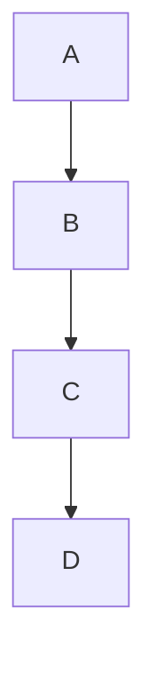

- [ ] to-do
- [/] incomplete
- [x] done
- [-] canceled
- [>] forwarded
- [<] scheduling
- [?] question
- [!] important
- [*] star
- ["] quote
- [l] location
- [b] bookmark
- [i] information
- [S] savings
- [I] idea
- [p] pros
- [c] cons
- [f] fire

---
# Markdown Cheat Sheet

> A demo file containing most Markdown elements.

---
# Heading 1 
## Heading 2 
### Heading 3
#### Heading 4

##### Heading 5
###### Heading 6 

---

# Text Formatting

Lorem ipsum dolor sit amet, consectetur adipiscing elit. Aenean fermentum ante in ullamcorper egestas. Proin venenatis dignissim enim quis rutrum. Donec dignissim suscipit ex ac ullamcorper. Praesent eu felis nec justo suscipit ornare.

Normal text
**Bold Text**
__Bold using double underscores__
*Italic Text*
_Italic using single underscore_
***Bold + Italic***
~~Strikethrough~~
<u>Underline (HTML)</u>
<mark>Highlight (HTML)</mark>
==Highlight==

---

# Paragraphs

Lorem ipsum dolor sit amet, consectetur adipiscing elit. Aenean fermentum ante in ullamcorper egestas. Proin venenatis dignissim enim quis rutrum. Donec dignissim suscipit ex ac ullamcorper. Praesent eu felis nec justo suscipit ornare.

This is a paragraph.

And this is a new paragraph.

First line  
Second line (Line Break)

---

# Blockquotes

> Lorem ipsum dolor sit amet, consectetur adipiscing elit. Aenean fermentum ante in ullamcorper egestas. Proin venenatis dignissim enim quis rutrum. Donec dignissim suscipit ex ac ullamcorper. Praesent eu felis nec justo suscipit ornare.

> Quote
>> Nested quote inside a quote

---

# Lists

## Unordered

- Lorem ipsum dolor sit amet, consectetur adipiscing elit.
- Aenean fermentum ante in ullamcorper egestas.
  - Sub-item
    - Deeper sub-item

*

* Item

+

+ Item

---

## Ordered

1. First
2. Second
3. Third

4. Item
   5. Sub-item
   6. Sub-item

---

# Task List

- [ ] Incomplete task
- [x] Completed task
- [ ] Another example

---

# Code

Inline Code:

`print("Hello")`

---

Code Block

```python
def hello():
    print("Hello World")
```

```javascript
console.log("Hello");
```

```cpp
#include <iostream>
using namespace std;

int main() {
    cout << "Hello";
}
```

Without language specification

```
Any text here
```

---

# Links

[Google](https://google.com)

<https://github.com>

Email link:

<test@example.com>

---

# Images


---

# Tables

| Name | Age | Country |
| :---: | :---: | :------: |
| Mohamed | 20 | Egypt |
| Ahmed | 25 | Saudi Arabia |
| Ali | 30 | UAE |

---

# Horizontal Rule

---

***

___

---

# Escape Characters

\*Not italic\*

\# Not a heading

\`

---

# Definition List

Term
: Definition

Another Term
: Another Definition

---

# Footnotes

This is an example[^1]

[^1]: This is a footnote.

---

# Emoji

:smile:

😄

🚀

🔥

---

# HTML inside Markdown

<div style="color:red">
This is HTML in red color 
</div>
<div style="color: blue">
This is HTML in blue color 
</div>
<div style="color: green">
This is HTML in green color 
</div>
<div style="color: orange">
This is HTML in orange color 
</div>
<div style="color: purple">
This is HTML in purple color 
</div>
<div style="color: black">
This is HTML in black color 
</div>
<div style="color: gray">
This is HTML in gray color 
</div>
<div style="color: brown">
This is HTML in brown color 
</div>
<b>Bold HTML</b>
<i>Italic HTML</i>

---

# Collapsible Details

<details>

<summary>Click here</summary>
This content is hidden.
</details>

---

# Superscript

X<sup>2</sup>

---

# Subscript

H<sub>2</sub>O

---

# Keyboard

<kbd>Ctrl</kbd> + <kbd>C</kbd>

---

# Checkboxes

- [x] Learn Markdown
- [ ] Learn HTML

---

# Alerts (GitHub)

> [!NOTE]
> Note

> [!TIP]
> Tip

> [!IMPORTANT]
> Important

> [!WARNING]
> Warning

> [!CAUTION]
> Caution

---

# Mermaid Diagram



---

# Math (if supported)

Inline:

$E=mc^2$

Block:

$$
a^2+b^2=c^2
$$

---

# Reference Link

[Google][google]

[google]: https://google.com

---

# Image with Link

[](https://google.com)

---

# Nested List Example

1. First
   - Item
     - Item
       - Item

---

# Mixed Formatting

**Bold _Italic_ `Code`**

---

# Quote with Code

> Use:
>
> ```bash
> npm install
> ```

---

# Table with Alignment

| Left | Center | Right |
| :--- | :----: | ----: |
| A    |   B    |     C |
| 1    |   2    |     3 |

---

# End of File

Most Markdown features have been tested.

# Heading 1

Lorem ipsum dolor sit amet, consectetur adipiscing elit. Aenean fermentum ante in ullamcorper egestas. Proin venenatis dignissim enim quis rutrum. Donec dignissim suscipit ex ac ullamcorper. Praesent eu felis nec justo suscipit ornare.

[[This is an existing Link]]
[[This is non-existing Link]]
**This is a bold text.**
*This is an emphasis text.*

---
### 1. Bold Text
Lorem ipsum dolor sit amet, **consectetur adipiscing elit**. Aenean fermentum ante in ullamcorper egestas.

### 2. Italic Text
*Proin venenatis dignissim enim quis rutrum.* Donec dignissim suscipit ex ac ullamcorper.

### 3. Strikethrough
Praesent eu felis nec justo ~~suscipit ornare~~. Lorem ipsum dolor sit amet.

### 4. Highlighted Text
==Aenean fermentum ante== in ullamcorper egestas. Proin venenatis dignissim enim quis rutrum.

### 5. Unordered List
- Lorem ipsum dolor sit amet
- Consectetur adipiscing elit
- Aenean fermentum ante

### 6. Ordered List
1. Proin venenatis dignissim
2. Enim quis rutrum
3. Donec dignissim suscipit

### 7. Task List
- [x] Lorem ipsum dolor sit amet
- [ ] Consectetur adipiscing elit
- [ ] Aenean fermentum ante

### 8. Blockquote
> Lorem ipsum dolor sit amet, consectetur adipiscing elit. Aenean fermentum ante in ullamcorper egestas.

### 9. Inline Code
Use the command `lorem ipsum` to generate text. Consectetur adipiscing elit.

### 10. Code Block
```python
print("Lorem ipsum dolor sit amet")
# Consectetur adipiscing elit
```

### 11. Link
[Click here for Lorem Ipsum](https://example.com) - Aenean fermentum ante in ullamcorper egestas.

### 12. Image
 
*Proin venenatis dignissim enim quis rutrum.*

### 13. Table
| Feature     |     Description      |
| :---------- | :------------------: |
| Lorem       | Ipsum dolor sit amet |
| Consectetur |   Adipiscing elit    |

### 14. Horizontal Rule
Lorem ipsum dolor sit amet.
---
Consectetur adipiscing elit.

### 15. HTML Color (Red)
<div style="color:red">Lorem ipsum dolor sit amet, consectetur adipiscing elit.</div>

### 16. HTML Color (Blue)
<div style="color:blue">Aenean fermentum ante in ullamcorper egestas.</div>

### 17. Collapsible Details
<details>
<summary>Click for Lorem Ipsum</summary>
Proin venenatis dignissim enim quis rutrum. Donec dignissim suscipit ex ac ullamcorper.
</details>

### 18. Superscript & Subscript
H<sub>2</sub>O and X<sup>2</sup>. Praesent eu felis nec justo suscipit ornare.

### 19. Keyboard Input
Press <kbd>Ctrl</kbd> + <kbd>S</kbd> to save. Lorem ipsum dolor sit amet.

### 20. Alert Note

> [!NOTE]
> Lorem ipsum dolor sit amet, consectetur adipiscing elit. Aenean fermentum ante in ullamcorper egestas.
 fermentum ante in ullamcorper egestas.
