# AnuPpuccin Pro Mod

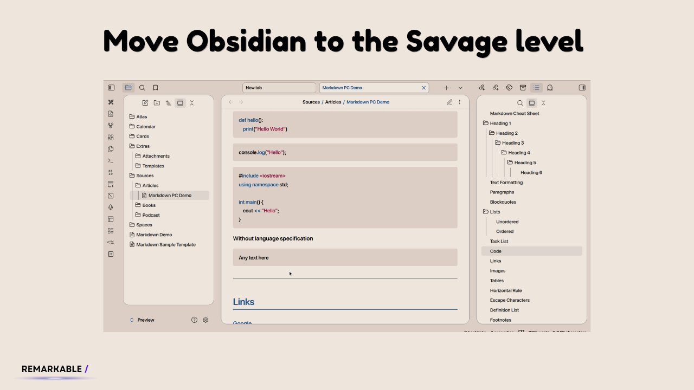
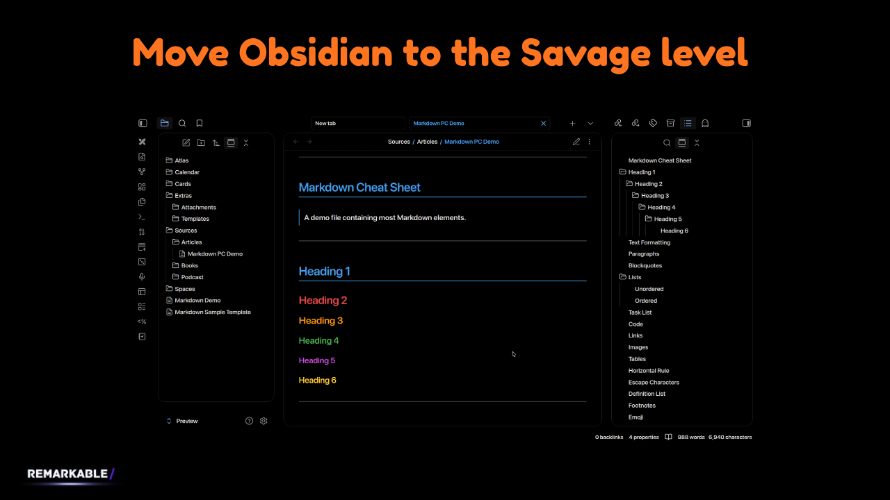

Welcome to **AnuPpuccin Pro Mod**! 

The original [AnuPpuccin theme](https://github.com/AnubisNekhet/AnuPpuccin) is amazing, but I wanted something more focused and clean. So I built this modification to create a premium, distraction-free workspace. 

**My goal?** Build the perfect reading and studying environment for students, researchers, and anyone who wants to focus on what matters—without visual clutter.

---

## Current Status

**Built for myself, shared with everyone.**

I made this for my own workflow, and I use Dark Mode exclusively. That's why Dark Mode gets most of my attention. Both modes work great, but here's where they stand (including our newest addition, the Default Pro Theme):

| Theme / Mode | Completion | Status |
| :--- | :--- | :--- |
| **AnuPpuccin Mod - Light Mode** | 95% | Nearly perfect, just tiny tweaks left. |
| **AnuPpuccin Mod - Dark Mode** | 85% | Works great, actively improving it. |
| **Default Pro Theme (Snippet)** | 100% | Flawless on all devices. Pure theme & eye-friendly colors. |

Still working toward 100% on the AnuPpuccin mods!

**For AnuPpuccin Theme only** - Since Obsidian uses standard CSS, it should work 80-97% perfectly on Apple devices too—I just haven't tested it myself. Worth trying! You've got nothing to lose.

## Quick Test - No Setup Required

Don't want to touch your current vault settings? No problem! 

I included a ready-to-use demo vault so you can see the theme in action immediately:

1. Download or clone this repo.
2. Open Obsidian → Open folder as vault.
3. Select the `preview.zip` zip file and extract it.
4. Start exploring—colors, layouts, everything!

**Note:** There is also a brand-new `Markdown Demo.md` file located directly in the `main` root directory (not hidden in any folders). You can download this single note and drop it directly into your personal vault to immediately preview how all markdown elements look in your own setup!

## How This Differs From Default AnuPpuccin

Love AnuPpuccin but want it cleaner? This is for you.

| Feature | Default AnuPpuccin | This Mod |
| :--- | :--- | :--- |
| **Dark Mode** | Dark gray / Soft dark | True Black (`#000000`) — saves battery on OLED screens |
| **Borders** | Visible lines everywhere | Borderless — clean, floating elements |
| **Mobile Toolbar** | Stuck to keyboard | Floating glass capsule (iOS-style) |
| **Settings** | Plain lists | Card layout with smooth iOS toggles |
| **Code Blocks** | Boxy with borders | Seamless & rounded with custom colors |
| **Headings** | Always-visible arrows | Hidden arrows that show on hover only |

## The "Default Pro Theme" Snippet

In addition to the AnuPpuccin modifications, I have added a brand-new snippet called `Default Pro Theme.css`. 

Unlike the other files that are strictly tied to the AnuPpuccin theme's layout and changes, this snippet is built directly for Obsidian's native Default Theme. 

**Why use it?**
* It does not change the core layout; it respects the native app's theme, the accent colors you choose, and official Obsidian updates.
* It ONLY modifies the backgrounds: introducing a very comfortable, relaxing yellow background for Light Mode, and a pure AMOLED black for Dark Mode.
* Because it relies on Obsidian's default architecture, this snippet is **100% complete and completely bug-free** across all devices!

---

## Screenshots - For AnuPpuccin Theme Only

See how this transforms your workspace (Note: These showcase the AnuPpuccin Mod, not the Default Pro Theme):

  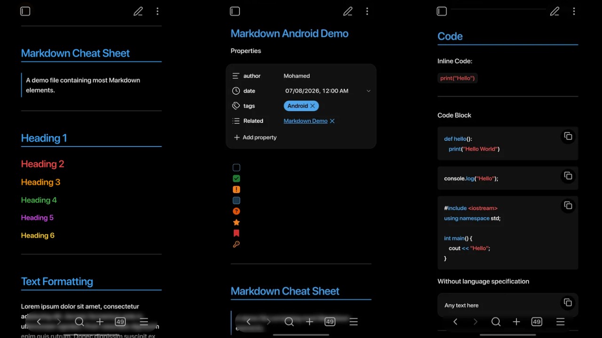
  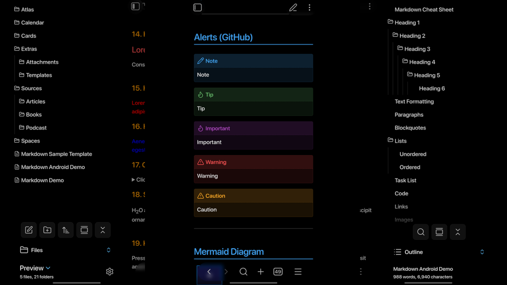
  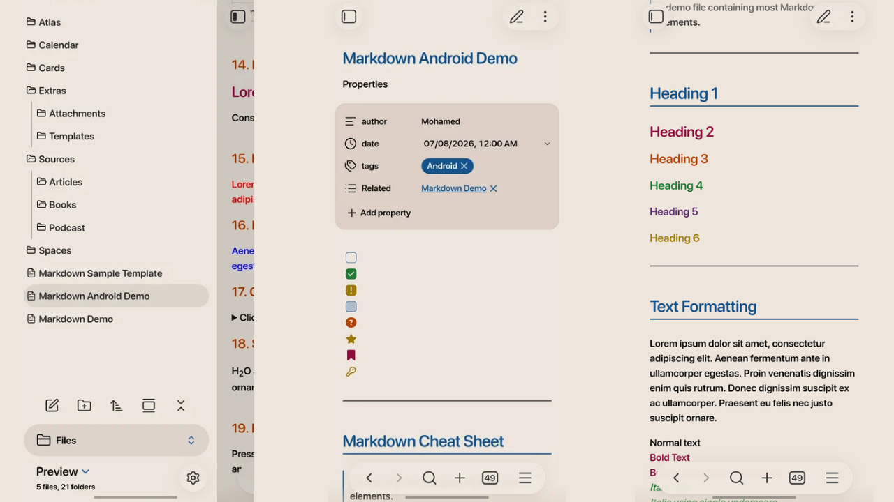
  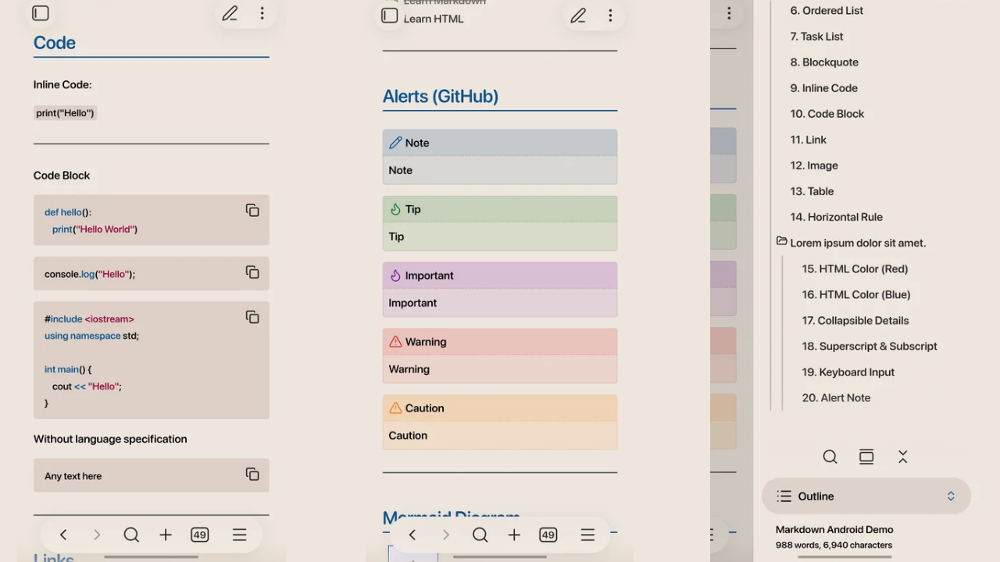
  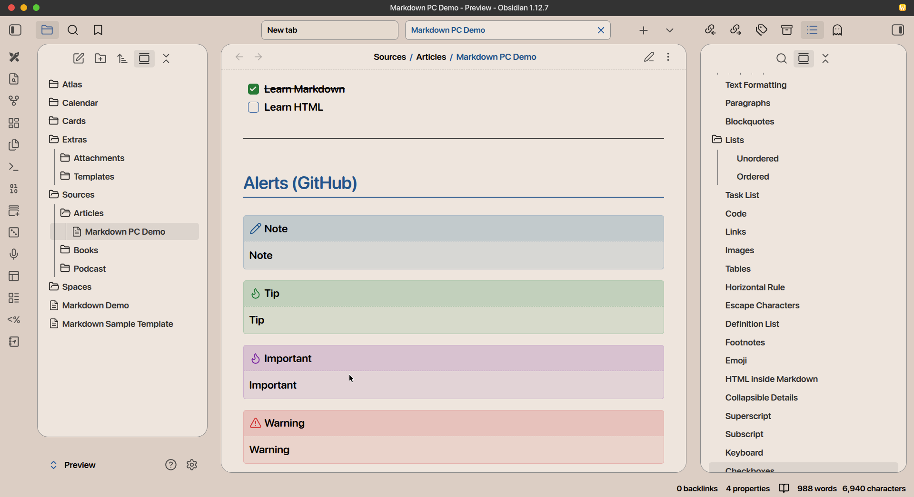
  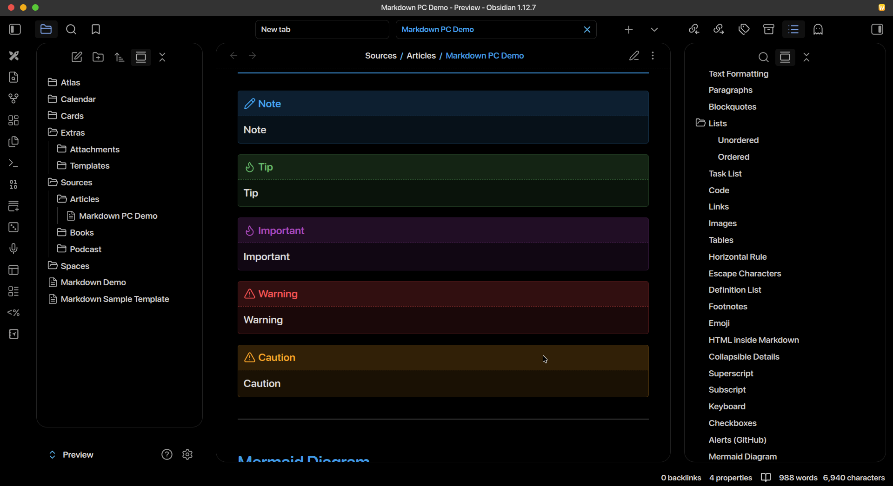
  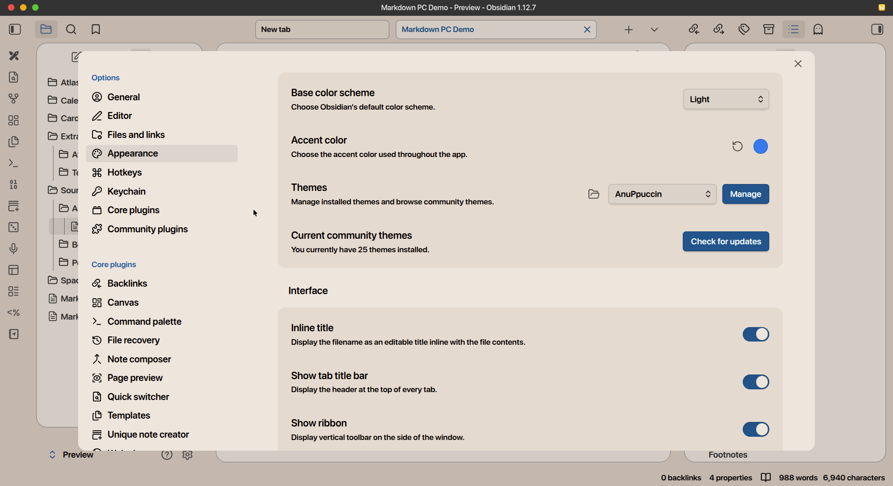
  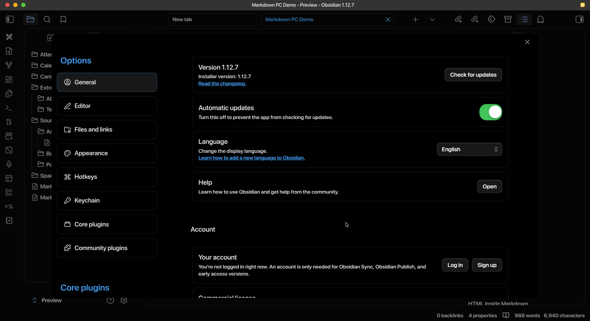
  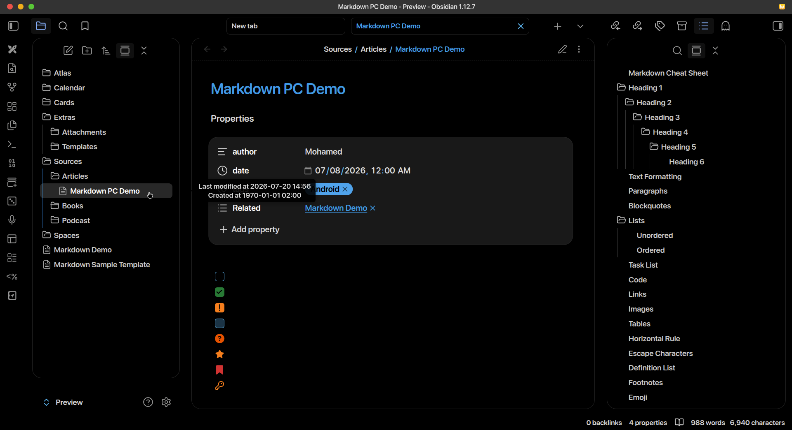
  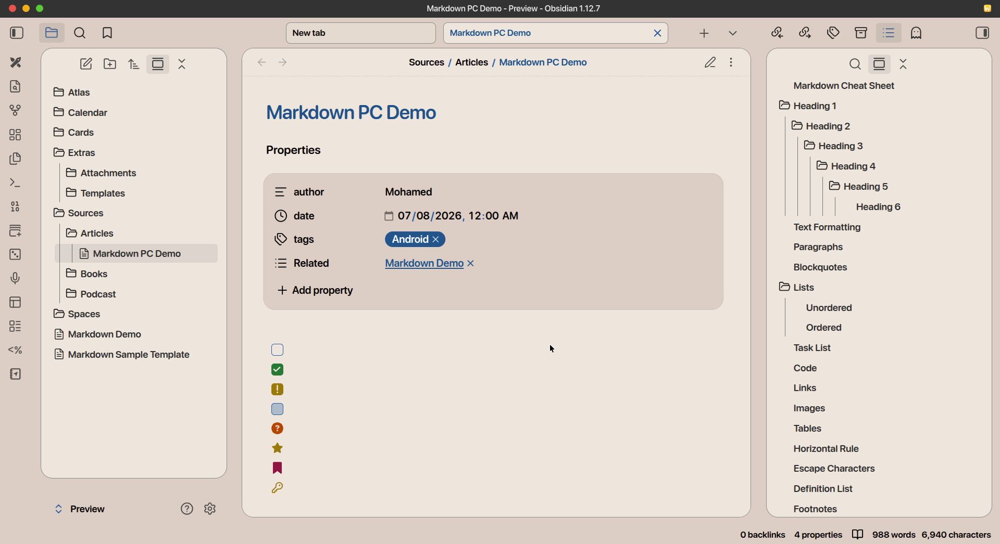
  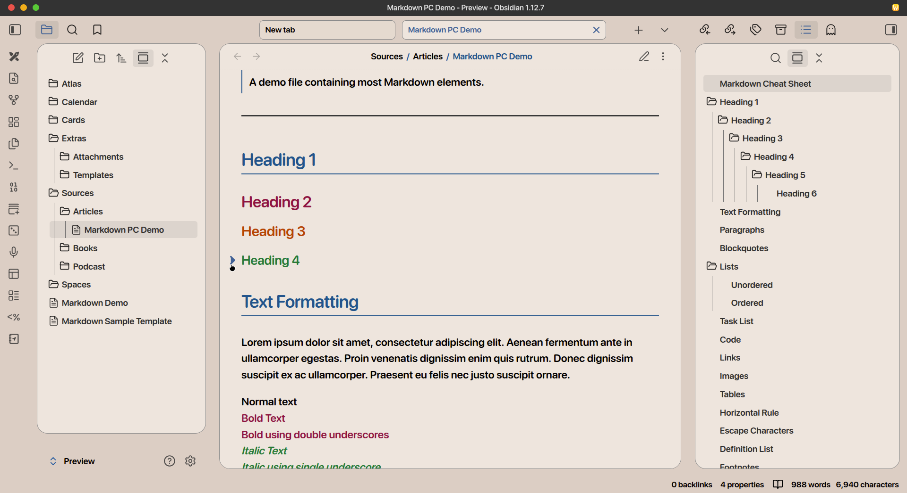
  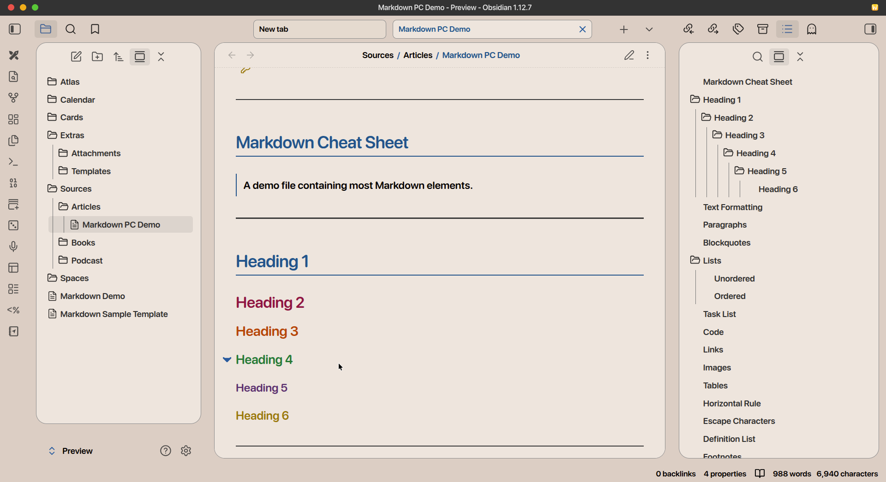

---

## What's Inside

Everything is organized in separate files so you can pick what you need:

* 📁 **`preview/`** — Complete demo vault to test safely.
* 📁 **`Screen/`** — All screenshots.
* 📄 **`Markdown Demo.md`** — A standalone file to preview markdown elements in your vault.
* 📁 **`snippets/`** — The actual CSS modifications:
  * `anuppuccin-custom-tweaks.css` — Core stuff: black UI, colors, border removal, mobile improvements.
  * `code-blocks-colors.css` — Syntax highlighting & code block styling.
  * `os-default-fonts.css` — Uses your system fonts for better performance.
  * `Default Pro Theme.css` — The new 100% flawless snippet for Obsidian's default theme.
* 📄 **`style-settings-export.json`** — My exact Style Settings config.

## Recommended Plugins

I highly recommend adding the **[Iconic By Holo](https://github.com/FlorianWoelki/obsidian-iconize)** plugin to your Obsidian setup. It allows you to add beautiful icons directly next to your files, folders, and notes, completing the premium look of this workspace.

## Before You Install

Make sure you have:
* **AnuPpuccin theme** installed and active in Obsidian (if using the AnuPpuccin mods).
* **Style Settings** plugin installed (from Community Plugins).

## Installation

Choose which theme modification you want to install:

### Option A: Installing AnuPpuccin Pro Mod

**Step 1: Set the Base Theme**
Go to Obsidian → Settings → Appearance → Themes, and select the **AnuPpuccin** theme.

**Step 2: Import My Settings**
To get the exact look from the screenshots:
1. Open Obsidian → Enable **Style Settings** plugin.
2. Open `style-settings-export.json` from this repo → Copy everything.
3. Go to Settings → Style Settings.
4. Click **Import** (top of page).
5. Paste → Click **Save**.

**Step 3: Add CSS Snippets (Desktop & Mobile)**
* **Desktop (Windows/Mac/Linux):**
  1. Download `.css` files from the `snippets/` folder.
  2. Go to Obsidian → Settings → Appearance.
  3. Scroll down to CSS Snippets → Click the folder icon 📁.
  4. Drop the `.css` files into that folder.
  5. Go back to Obsidian → Click refresh → Toggle your desired snippets ON.
* **Mobile (Android & iOS):**
  1. Download `.css` files to your phone.
  2. Go to your vault → `.obsidian/snippets/` (these are hidden folders). Create the `snippets` folder if it is missing.
  3. **iOS Users:** Use the Files app or a file manager to see hidden folders.
  4. Paste the `.css` files there.
  5. Open the Obsidian app → Settings → Appearance → Turn snippets ON.

---

### Option B: Installing Default Pro Theme (Snippet)

If you want the purest, most stable experience with pure theme mode and eye friendly colors:

**Step 1: Set the Base Theme**
Go to Obsidian → Settings → Appearance → Themes, and make sure it is set to **Default**.

**Step 2: Add the CSS Snippet**
Follow the exact same instructions from **Step 3 above** (for Desktop or Mobile) to place the `.css` files into your `snippets` folder.

**Step 3: See the Magic!**
Go to Obsidian → Settings → Appearance → CSS Snippets.
**Important:** If you downloaded all the files from this repository, make sure to turn **OFF** all the AnuPpuccin-related snippets, and leave **ONLY** the `Default Pro Theme.css` toggled **ON**. Now, watch the magic!

---

## Known Issues (For AnuPpuccin Mod)

Building this in my free time, so perfection takes time. Here's what still needs work (Note: The Default Pro Theme snippet is completely bug-free):

* [ ] **Mobile Dark Mode:** Files menu background is transparent.
* [ ] **Code Editor:** Live Preview styling in Dark Mode needs polish.
* [ ] **Mobile Tables:** Don't look as clean as desktop version yet.

## Want to Help?

This is community-powered. All contributions are welcome:
* New CSS features or UI improvements
* Better mobile/tablet support
* Documentation fixes
* Bug fixes (especially the ones above!)
* Performance tweaks

Open an issue or submit a PR. Let's build the perfect study tool together!

## License

**MIT License** — do whatever you want with it. 
Use it, modify it, share it, fork it — personal or commercial, no restrictions.

*(Note: This is a CSS mod, not the official AnuPpuccin. Huge thanks to AnubisNekhet for the base theme!)*

## 💖 Support the Project

If this helps you, consider supporting development. Every bit helps keep this free and improving. 🌍✨

  

---

### Final Words

I built this for myself. If it helps you too, that's even better.

Made with curiosity, late-night coding sessions, and love for open-source.

Thanks for using it and being part of this journey. 🤟😘
